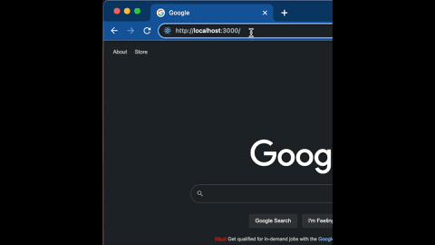
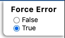

# Instructions

The following contains instructions for completing this coding assessment. We recommend reading this document in its entirety before beginning to write any code.

## Overview

For this coding assessment, you will be working on a React app to implement certain functionality detailed below. The high-level workflow will include:

1. Get the project running locally
1. Implement the required code
1. Submit the code to **Discuss** for review

While the assessment can be completed in a few hours or less, to better accommodate busy schedules, **you will have 5 days to complete the assessment** starting from the time you receive it.

Once you have submitted the assessment, it will be reviewed by the Discuss team and you will be notified within two weeks if you are selected to move to the next round of the interview process.

> **Note:** If you are selected to move to the next round of interviews, you will be expected to talk about the code you wrote in this assessment, including the reasons behind the decisions you made.

## Submission Instructions

Once you have completed this project, you should:

1. zip the project folder into a compressed file
   - for most operating systems, you can right click on the folder and select "compress"
1. Rename the file so that the filename is your first name and last name, separated by a hyphen. Example: `jane-doe.zip`
1. Upload the zipped folder to Google Drive (or similar file upload service with sharing capability)
1. Share the uploaded file with `eng-hiring@discuss.io`
1. Send an email to `eng-hiring@discuss.io` that includes:
   - Email subject that says `Support Engineer Assessment - Jane Doe`, replacing `Jane Doe` with your own first and last name.
   - Email body containing a link to your uploaded project file

> Note: If you use Gmail, you can simply attach the zip file to the email, and Gmail should automatically prompt you to upload it to Google Drive. Then, when you press send, it will automatically prompt you to share it with the recipient email (i.e. `eng-hiring@discuss.io`)

**If for any reason you run into any issues with or have question about the process, please reply to the email you received containing the original assessment invite**

## Run project locally

Before you'll be able to work on the project, you'll need to get the project running locally on your computer by following the steps below.

### Step 0 - Prerequisites

You need to have [NodeJS](https://nodejs.org/) and [NPM](https://www.npmjs.com/) installed on your computer to be able to run this project. If you do not have it, you can download NodeJS [here](https://nodejs.org/en/download), which will also install NPM.

### Step 1 - Clone the project

First, clone the project from the GitHub url that was provided to you like so:

```bash
git clone git@github.com:discussio/support-engineer-coding-assessment.git
```

(Alternatively, you can download the project directly from GitHub.)

### Step 2 - Install dependencies

Next, install the project dependencies by running the following:

```bash
npm install
```

### Step 3 - Run dev server

Then, run the development server with the following command:

```bash
npm start
```

### Step 4 - View the app in the browser

Now, open your browser to `http://localhost:3000` to view the app running locally on your computer.

**You are now ready to begin coding!**

When the development server is running, changes made to the code will trigger an update to the app which will be reflected in the browser.

## Project Requirements

For this coding assessment, you will be implementing certain functionality of a React app.

At a high-level, you will be writing code to fetch and display a list of items, and add/remove items from said list.

While you are welcome to create additional files in this project if desired, you should only need to write code in `App.js` and `App.css` in order to complete this coding assessment.

### Rules

1. The work you submit for this assessment MUST be your original work, authored by you.
1. You MUST NOT share this assessment with anyone else, either partially or in its complete form
   - This includes posting any part of this assessment online
1. You MAY NOT use or install any third party dependencies
   - Example: Using native `fetch` is allowed, but not `axios`, `react-query`, etc.
1. You MAY use the internet or other technical resources
   - Example: Google, [react.dev](https://react.dev/), [Stack Overflow](https://stackoverflow.com/)

### Requirements

Your app should:

1. Fetch and displays a list of pokemon (using `GET /pokemon`)
1. Display a loading indicator while list of pokemon loads
1. Allow a user to add a new pokemon to the displayed list (using `POST /pokemon`)
1. Allow a user to delete a pokemon from the displayed list (using `DELETE /pokemon`)
1. Display an error message when fetching pokemon fails
   - (use "Force Error" `true` to cause fetch to fail)

> Note: While you should feel free to use css to structure your app, you will not be assessed based on the visual aspects of your app so feel free to skip any styling that isn't related to functionality.

### Example Solution

Here is an example of what the desired functionality might look like:



### Testing Error States

In order to test that your app properly handles error states when loading pokemon, you need the `GET /pokemon` HTTP request to fail. You can force this API call to return an error response by setting `Force Error` to `true`. This control should be displayed in the top-right corner of your browser.



## API Documentation

This project includes a mocked API you will use to implement the desired functionality.

Example Usage:

```javascript
fetch("/pokemon").then((res) => {
  console.log(res);
});
```

The following details each of the HTTP API endpoints need for this project.

---

### FETCH ALL POKEMON

Fetches a list of all pokemon

**Request**

**URL:** `/pokemon`

**Method:** `GET`

**Example Success Response**

```json
[
  {
    "id": "56e0ccaa-57a8-4614-9d94-d5cb33e694eb",
    "name": "Pikachu"
  },
  {
    "id": "560e1bcd-4cbe-48e5-b586-3c1962dc19a1",
    "name": "Bulbasaur"
  }
]
```

**Example Error Response**

> NOTE: When errors are enabled, this endpoint will return a response with a 500 status code, and no body

---

### CREATE NEW POKEMON

Adds a new pokemon to the list

**Request**

**URL:** `/pokemon`

**Method:** `POST`

**Body:**

```
{
  "name": "NEW_POKEMON_NAME"
}
```

**Response**

> NOTE: For convenience, this endpoint returns the updated array of pokemon (after the new pokemon has been inserted). Thus, the response type is the same as the Success Response of `GET /pokemon`.

---

### DELETE A POKEMON

Deletes a pokemon from the list

**Request**

**URL:** `/pokemon/:id`

**URL Parameters:** `:id` should be replaced with the id of the pokemon you wish to delete

**Method:** `DELETE`

**Response**

> NOTE: For convenience, this endpoint returns the updated array of pokemon (after the designated pokemon has been deleted). Thus, the response type is the same as the Success Response of `GET /pokemon`.
